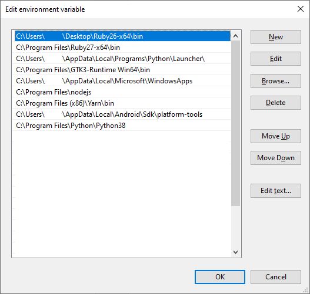

# Additional Notes
A collection of useful information and tips about the Windows ecosystem.

## Environment Variables
To run an application in PowerShell you either need to know the full location of that executable 
(such as: `& "C:\Program Files\Java\jdk-12.0.2\bin\java.exe" -version` the `&` in this instance just tells 
PowerShell that the following string points to an executable). Or it needs to be on the path; if 
`C:\Program Files\Java\jdk-12.0.2\bin\` is on the path then you can simply type `java -version`. 
So how do you add programs to the path?  Well first you should consider that you might not want to add everything to the 
path; only folders which you think you will need to use from the command line.

To add a folder to the path search for Environment Variable in the start menu, the first option should open 
System Properties. Click on Environment Variables at the bottom right; at the top you can see all the user 
variables. We are interested in the Path Variable so select it and click Edit. To add a new folder to the 
path click New (top right) and write the full folder name. There is also a path variable under system variables 
(the bottom box) which applies to all users however you should mainly use the path under user variables.

## Unix Emulation
Windows Subsystem for Linux (or WSL) lets you run Linux software and a full Linux command line from within Windows 
without having to reboot or run a Virtual Machine. You can also access all your Windows files from WSL without 
having to do any magic or hackery. If you need this functionality a good guide can be found here:
https://docs.microsoft.com/en-us/windows/wsl/install-win10.
